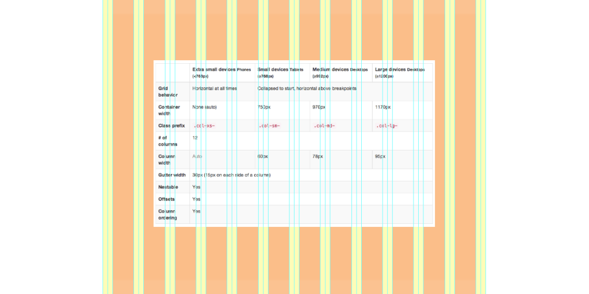

# Savoir-Faire Linux

## La grille adaptative

---

# Pourquoi ?

* Standardisation, standardisation, standardisation !

# Presenter notes

* Visuels
    * Margin, padding
* Comportements

---

# Comment la grille se présente sous Twitter Bootstrap 2.3.2/3 ?

* [Démonstration sous Twitter Bootstrap 3](grid.html)
* [Démonstration sous Twitter Bootstrap 2.3.2](grid-tb-2.3.2.html)

# Presenter notes

* Des classes CSS qui englobent et définissent notre grille
* Des classes CSS pour définir nos colonnes
    * La largeur des colonnes peut varier entre les différents médiums utilisés
* Modification possible de l’ordre des colonnes
* Flexibilité
    * Nous pouvons définir notre propre grille avec les mixins sous TB3

---

<h1 style="text-align: center;">”Respect the grid” - Émilien</h1>

---

# À retenir

---

# Pour Twitter Bootstrap 3

* Gouttière implicite (non visible mais bien présente)
    * 15px de chaque côté de toutes les colonnes; incluant la première et la dernière colonne !
* Grande flexibilité pour passer d’une grille mobile à une grille desktop
* Nous l’utiliserons dans la plupart de nos projets qui ne sont pas sous Drupal ou Liferay.

---

# Pour Twitter Bootstrap 2.3.2

* Gouttière explicite
* Liferay l’utilise dans sa console d’administration
* Moins flexible que la dernière version
